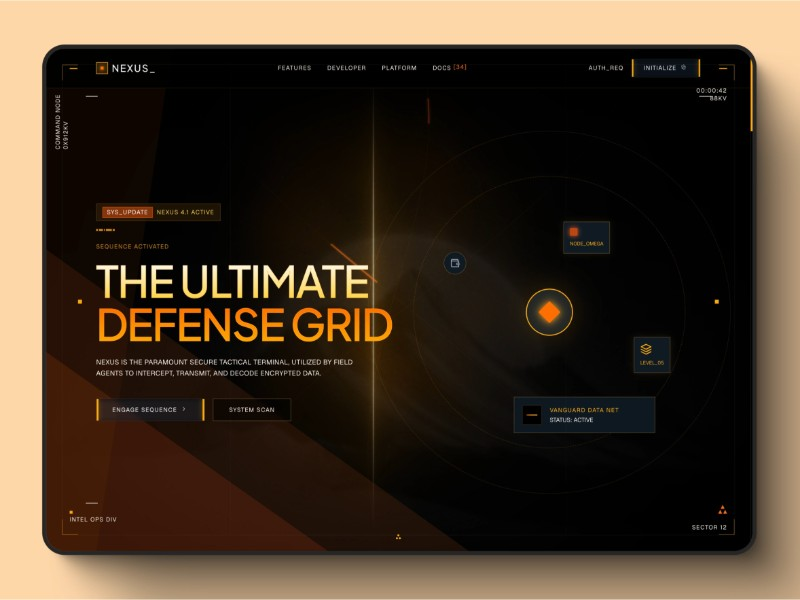

# Aegis AI - Autonomous Threat Intelligence Grid

A high-performance, sci-fi tactical dashboard and cyber-defense landing page template built using HTML, TailwindCSS, WebGL shaders, and GSAP animations. 

This project is a 1:1 clone of the Nexus Cyber template, themed specifically for **AI-Driven Threat Intelligence**, featuring autonomous security swarms, automated mitigation networks, and real-time threat-vector telemetry.



## Key Features

- **Dynamic WebGL Shader Background:** A custom WebGL-rendered orange laser pillar and smoke drift effect utilizing fractal noise and brownian motion.
- **GSAP Intro Sequence:** A custom animated boot-up sequence that fades in HUD lines, coordinates, telemetry nodes, and title typography on page load.
- **Interactive Flashlight Glow Cards:** Custom mousemove-tracking grid features that apply a dynamic amber glow overlay according to mouse pointer coordinates.
- **Responsive Bento Layout:** Clean bento-box-style configurations for displaying agent specs, live threat vectors, and coordination metrics.
- **Modular Telemetry Logs:** Interactive FAQ-like decision logs simulating swarm cognition status, agent autonomy thresholds, and network logs.
- **Modern Tech Stack Integration:** Self-contained and optimized using CDN links for TailwindCSS, GSAP, Three.js, and Iconify.

## Tech Stack

- **Core:** HTML5, CSS3, ES6+ Javascript
- **WebGL Rendering:** Three.js
- **Animations:** GSAP (GreenSock Animation Platform)
- **Styling:** TailwindCSS (via CDN)
- **Icons:** Iconify Web Component API
- **Build Tool:** Vite

## Getting Started

### Prerequisites

You need [Node.js](https://nodejs.org/) installed on your machine.

### Installation

1. Clone this repository:
   ```bash
   git clone https://github.com/ArnavNah/Nexus-Cyber.git
   cd Nexus-Cyber
   ```

2. Install dependencies:
   ```bash
   npm install
   ```

3. Run the development server:
   ```bash
   npm run dev
   ```
   The application will boot up at [http://localhost:3000/](http://localhost:3000/).

4. Build for production:
   ```bash
   npm run build
   ```
   Production-ready files will be generated inside the `dist/` folder.

## License

This project is open-source and available under the [MIT License](LICENSE).
